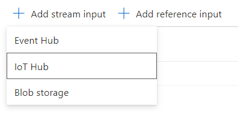
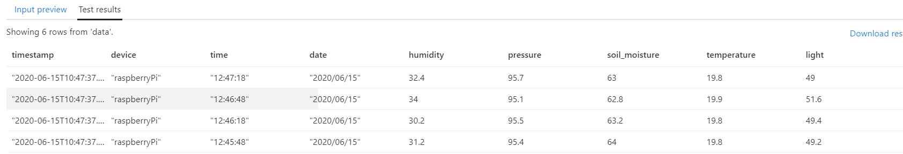
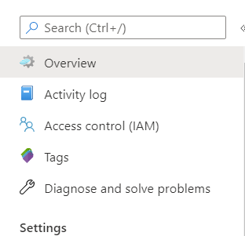
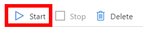

# Create Stream Analytics Job stream telemetry data from IoT Hub to Storage Account

In the [previous step](./Create_storage_account.md) you have created the storage account to store the data. In this step, you will create a Stream Analytics Job to stream the data from the IoT Hub to the table in the storage account automatically.

## Azure Stream Analytics

[Azure Stream Analytics](https://azure.microsoft.com/services/stream-analytics/?WT.mc_id=agrohack-github-jabenn) provides real-time analytics on streams of data, allowing you to stream data from one service to another.

### Create the Stream Analytics Job

1. Log into your [Azure Portal](https://portal.azure.com/)

1. Click on **+ Create a Resource**.

    

1. Search `stream` in the search bar and select **Stream Analytics job**. Then click on create.

    

1. Fill in the details as follows:

    * Job name: write something like `streamData`.

    * Subscription: choose your subscription.

    * Resource group: choose `sensorMonitor`.

    * Location: choose your location.

    * Streaming units: change it to one.

    

1. Click on **Create**.

### Add an input

1. On the left panel, under **Job Topology**, click on **Inputs**.

    

1. Click on `+ Add input stream` and then select **IoT Hub**.

    

1. Complete the details as follows:

    * Input alias: `sensorData`.

    * Click on `Select IoT Hub from your subscriptions`.

    * Subscription: select your subscription.

    * IoT Hub: Select the IoT Hub you have created earlier.

    * Endpoint: Choose `Messaging`.

    * Share access policy name: choose `$Default`.

    * Consumer Group: choose `$Default`.

    * Leave the rest as it is.

### Add an output

1. On the left panel, under **Job Topology**, click on **Outputs**.

    

1. Click on **+ Add** and then select **Table Storage**.

    

1. Complete the details as follows:

    * Input alias: `data`.

    * Click on `Select table storage from your subscriptions`.

    * Subscription: select your subscription.

    * Storage account: Select the Storage account you have created earlier.

    * Table name: Click on **Use existing** and select `data`.

    * Partition key: `device`.

    * Row key: `timestamp`.

    The combination of the Partition key and the Row key has to be unique for each entry of the table. In this case the `device` column will be assigned to the **Partition key**, and the `timestamp` column to the **Row key**.

### Create Query

1. On the left panel, under **Job Topology**, click on **Query**.

    

1. Change the query to the following code:

    ```sql
    SELECT
        EventProcessedUtcTime as timestamp,
        'raspberryPi' as device,
        time,
        date,
        humidity,
        pressure,
        soil_moisture,
        temperature,
        light
    INTO [data] FROM [sensorData]
    ```

    This will pass the date, time, humidity, pressure, soil_moisture, temperature and light columns as they are received. Additionally, create two more columns: `device` and `timestamp`. Device will be equal to raspberryPi (you can also pass this parameter from the raspberryPi if using more than one device). Timestamp will be equal to the time the event is received.

1. Click on **Test query**. You should see something like this:

    

1. Save the query.

    

### Start the job

1. Go to the overview tab on the left pannel.

    

1. Click on **Start**. It may take a few minutes to start the job.

    

    It may take a few minutes so be patient.

-----------------------

[Next step](Create_function.md): Create Azure Function to tranfer the entries from the table to Power Apps.
