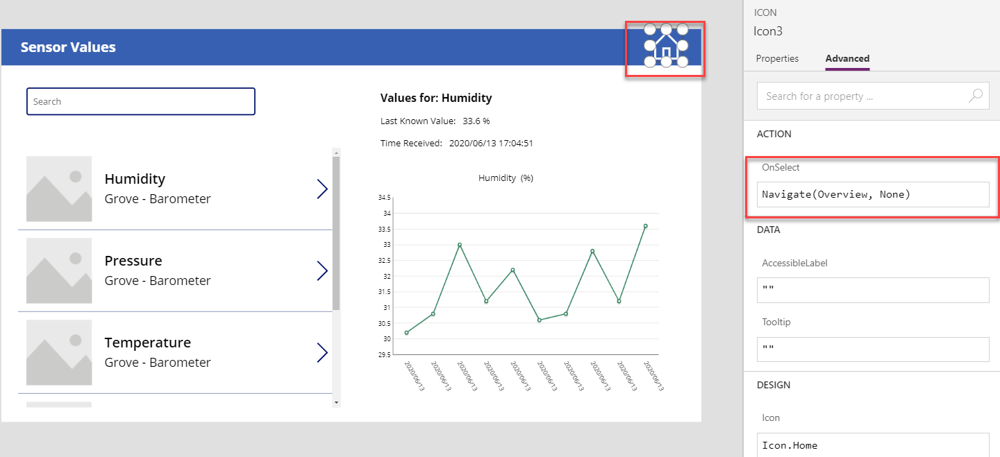

# Creating the app in PowerApps

In the [previous step](Create_function.md) you have created an Azure Function to gather all the data from the table in the Storage account. In this step, you will learn to create an app in Power Apps.

## PowerApps

[PowerApps](https://powerapps.microsoft.com/) is a platform that allows us to build an app without having deep understanding in programming. It has a very user friendly interface and allows you to connect to a great variety of data sources, from excel tables to outlook and Azure Services.

## Connectors

PowerApps has a great variety of connectors to import data from other sources such as: sharepoint, outlook, gmail, eventhubs... However, in this tutorial we will create our own custom connector to establish comunication with the API in our Azure Function. This way we will be able to customize the requests, and the data we want to get.

### Create custom connector

1. Go to *Data > Custom Connectors*.

    

1. Click on **New custom connector**, select **Create from blank** and enter the name of your connector

    

1. In the General section, select **HTTPS** for Scheme and enter your host address in the 'Host'

    

1. Go to **Security** section, leave it as it is. Click Definition.

    

1. In the **Definition** section, create an action on the left hand side. Enter the **Summary** and your **operation ID**. Set **Visibility** to `none`.

    

1. Toggle the **Swagger Editor** and replace the code from **line 9 to 15** to the following code, then click **Create connector**. This will get set the format of the retrieved message (in this case an array of objects) and the parameters for the request (top and partitionkey). Note that the parameters are optional when making a request.

    ```swagger
    paths:
    /api/req:
        get:
        responses:
            default:
            description: default
            schema:
                type: array
                items:
                    type: object
                    properties:
                        PartitionKey: {type: string, description: Partitionkey}
                        RowKey: {type: string, description: Rowkey}
                        humidity: {type: number, description: humidity}
                        soil_moisture: {type: number, description: soil moisture}
                        pressure: {type: number, description: pressure}
                        temperature: {type: number, description: temperature}
                        light: {type: number, description: light}
                        date: {type: string, description: date}
                        time: {type: string, description: time}
        summary: Returns Data from the table in the Storage account
        description: ''
        operationId: GetData
        parameters:
        - {name: partitionkey, in: query, required: false, type: string}
        - {name: top, in: query, required: false, type: integer, format: int32}
    ```

    

1. Now you should return back to the **Definition** page and the **Request** section should be updated. Under **Query** you should be able to see the optional parameters set (top and partitionkey).

    

1. Select the connection, if you cannot find any, then click **New Connection** to create a new one. In order to verify a connection has established to the storage account, click **Test operation**.

    

    If successfully established, the following message will display.

    

1. Then click **Update connector** and **Close**.

    

## Create a new App

### Create a overview screen

1. Open the [PowerApp Studio](https://create.powerapps.com/studio/) and create a blank app. Click **New** and select **Tablet Layout** in the **Blank App** section.

    

1. Open Excel and create a table as shown below. This is just static data for the sensors.

    

1. Click the **Data Sources** button (the cylinder one) and select `import from Excel`.

    

1. Tick the table name and select **Connect**.

    

    Once the connection is successful, you should be able to see your excel file here.

    

1. Click the **Connectors** to add the custom connector that you just created.

    

    Your **In your app** section should look like this now.

    

1. Click **Insert** and add 5 line charts in the canvas.

    

1. After adding 5 line charts, change the titles to the name of the sensors. You can personalize it by adding icons and text labels from the **Insert** section.

    

1. In order to get make the request to the storage account, we will use a timer. Go back to the **Input** section and select **Timer**. This timer will be used to make a request and update the data in the Power App.

    

    The default value of the timer is 60 seconds. Feel free to change this.

1. Now you should see a timer box in your canvas. Click the timer box and select **Advance**. Change the **OnTimeStart** to the following code.

    

    ```txt
    ClearCollect(sensorData, PowerAppsIoT.GetData({top:10}));
    ```

    This will get only the last 10 rows of the table.

1. Scroll down and in the 'DATA' section, set the booleans as follows:

    * Reset: **true**. This will reset the timer once it is finished.

    * Repeat: **true**. This will autostart the timer everytime.

    * Autostart: **true**. This will start the timer automatically every time the app is launched.

    

    If you want to hide your timer, you can set the **Visible** in the **DESIGN** section to *false*.

    

1. Now double click your graph and go to the advanced settings. Set the **Items** to the `sensorData` collection, and change the series according to the data to be displayed. The labels in this case is set to time, however you can change this to `rowkey` if you want to display the date and time.

    

1. Once you finish all the settings, press `F5` to start the app. The timer should start to count automatically.

### Create a detailed screen

1. Now click on **Insert** and create a new blank screen.

    

1. In the insert section, add three **Text label**, one **Text input** and one **Vertical Gallery**.

    

1. Select the **text input** that you just added and change its name to `SearchBar`. This will be used to access the sensors easily by using a search bar.

    Go to the **Advanced Settings** and change
    * **Default** to ""
    * **Hint Text** to **Search**.

    

1. Now click on the gallery and change the **Items** field to:

    ```txt
    Filter(sensorInfo, 'Searchbar'.Text in SensorName|| 'Searchbar'.Text in SensorModel)
    ```

    

    This will filter the elements inside the `sensorInfo` table, and display in the gallery those that contain the text in the `SearchBar`.

1. Select both search bar and gallery, then right click the 'Group' option to group them together.

1. You can change the information displayed in the gallery by clicking on the gallery > Properties > Layout.

    

1. Select the `Gallery` in the **Tree View** section and select **Title'**. In the formula bar, change this to:

    ```txt
    ThisItem.SensorName
    ```

    Now you should able to see the all your measurements.

    

    Do the same for the subtitle, and change it to:

    ```txt
    ThisItem.SensorModel
    ```

    

1. Click the arrow which is highlighted by the red box and paste following code in the formula bar.

    

    ```txt
    Select(Parent);

    Clear(dataValues);

    // Collect the data for the graph
    ForAll( sensorData,
        Collect( dataValues,  
            {
                time: time,
                value: Switch(
                    Gallery1.Selected.Measure,
                    "humidity", humidity,
                    "pressure", pressure,
                    "temperature", temperature,
                    "soil_moisture", soil_moisture
                ),
                date: date
            }
        )
    );

    // store the last measure and sensor selected
    Set(lastMeasure, Gallery1.Selected.Measure);
    Set(lastSensor, Gallery1.Selected.SensorName);
    // store the time of the last value received
    Set(timeRcv, Last(sensorData).date & " " & Last(sensorData).time);
    ```

    This is the only way to display the data in the graph for the selected sensor.

1. Click on one of the text labels and paste the following code to the formula bar. This will display the data corresponding to the last sensor selected.

    ```txt
    "Last Known Value:   " & Switch(
        lastMeasure,
        "humidity",
        Last(sensorData).humidity,
        "pressure",
        Last(sensorData).pressure,
        "temperature",
        Last(sensorData).temperature,
        "soil_moisture",
        Last(sensorData).soil_moisture
    ) & " " & Switch(
        lastMeasure,
        "humidity",
        "%",
        "pressure",
        "kPa",
        "temperature",
        "°C",
        "soil_moisture",
        "%"
    )
    ```

    

1. Repeat the same process for the other Text Label and paste the following code. This will display the date and time of the last value received if a sensor is selected.

    ```txt
    "Time Received:   " & If(lastMeasure <> "", Last(sensorData).date & " " & Last(sensorData).time)
    ```

    

1. Double click the line chart and add `dataValues` in the formula bar. Now the chart shoul be displaying the data inside the collection `dataValues`.

    

1. In order to know which measurement is showed, create another text label and group it with your 'Last Known Value ' and 'Time Received' labels. Double click the new text label and change its text to the following:

    

1. Now go back to your **Overview screen** and click the timer. Change the **OnTimeStart** to the following code to update the data of the sensor selected when the timer resets:

    ```txt
    ClearCollect(sensorData,PowerAppsIoT.GetData({top:10}));Clear(dataValues);ForAll(sensorData,Collect(dataValues,{time:time,value:Switch(lastMeasure,"humidity",humidity,"pressure",pressure,"temperature",temperature,"soil_moisture",soil_moisture),date:date}))
    ```

    

1. For a better visualisation, you can also rename screens.

    

1. To navigate between two screens when the App is running, you can create two icons on each screen.

    To add an arrow icon, select insert, click **Icons** and scroll down to find the **Right** arrow.

    

1. Click the arrow and write this code in the **OnSelect** bar. (i.e `Sensors` is the name of the other screen)

    ```txt
    Navigate(Sensors, None)
    ```

    

1. Repeat the same process for the other screen

    ```txt
    Navigate(Overview, None)
    ```

    

----------

Now you have a fully functional app created with Power Apps.

You can now try to create an application in [IoT Central](../IoTCentral/) or move on to [scenario 2](../../Lab2_WaterYourPlant/).
