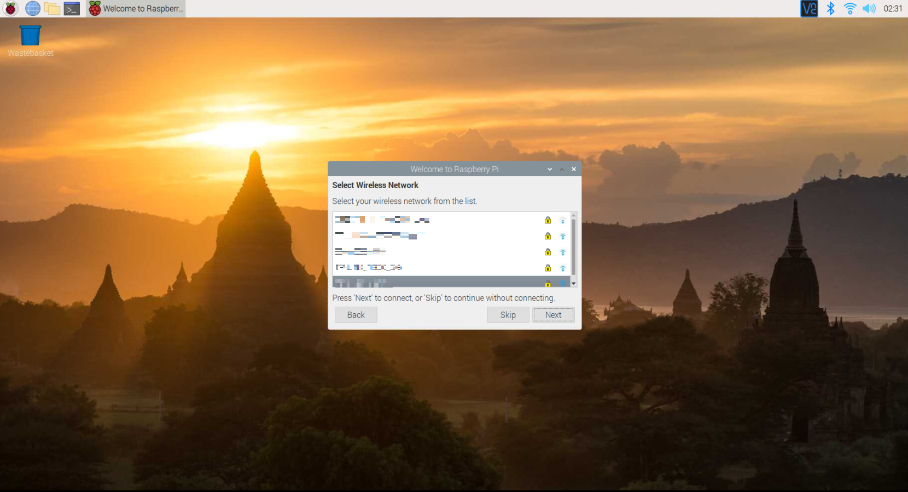
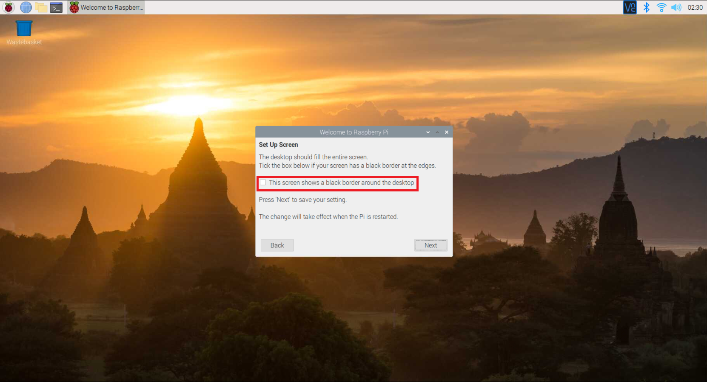

Configure your I2C Interface
============================================

(description of what you need to do and why in relation to I2C interface)

Preparation
-----------

-   Complete [Step 1b – Assemble your Hardware](1b_Assemble_your_hardware.md)

-   Make sure you have your Raspberry Pi, micro SD card, and  power supply ready at hand for this step. *Optional: ethernet cable*

-   Find access to a computer mouse, keyboard, monitor, and HDMI cable.

-   Verify that a micro SD card is already inserted in the Raspberry Pi. If not,
    please refer to the Assemble your Hardware guide
    before continuing with this process.

Connecting to the Internet
---------------------------

There are multiple options to getting your Raspberry Pi online and reachable by
your PC.

*Note: Internet connectivity and device to device communication is the area that
often requires the most troubleshooting. See Known Issues and Frequently Asked
Questions if you are having issues getting your device online.*

-   **To connect with an Ethernet Cable** – Plug one side of the LAN cable into
    the Raspberry Pi and the other into the same Ethernet Hub or Switch that
    your PC is plugged into.


-   **To connect with a Wi-Fi connection** – follow the steps later in this
    document

Plug in the Mouse, Keyboard, Monitor
------------------------------------

The easiest way to troubleshoot connectivity issues and see what is going on
with your networking status is to connect a mouse, keyboard and monitor to the
Raspberry Pi device. This can help you provision wi-fi or lookup the IP address
if you are plugged into ethernet. You can use the console to see the network IP
address. There is a command line interface provided when the device is booted
that lets you do troubleshooting commands like *ping* and *ipconfig /all*.

-   Plug in the mouse and keyboard to the Raspberry Pi USB

-   Plug in the HDMI monitor to the Raspberry Pi HDMI and power on the computer
    monitor


## Power on your device

- Plug the large end of the micro USB cable into the power adapter and insert
    power adapter into a power source

- Plug the small end of the micro USB cable into the Raspberry Pi and Power
    Up! A red light should shine on the motherboard.


- Booting the device until it’s ready to use takes a few minutes. You should
    see the Raspberry Pi logo within a few seconds and be able to watch this process
    on the monitor.

- If you see nothing on the screen, check the screen is on, check the input
    source on the screen, check the HDMI cable is plugged in at both ends, and
    check that the SD card is installed, and check that the SD card has software
    installed.


## Setting up your Pi

When powered on for the first time you need to do a few steps on the device. You will need to change your login password, set up or test your connection to the internet, and enable the I2C interface (required for using the grove sensors).

- If you are prompted to login, the default login is username `pi` with the password `raspberry`. Note that you will not see any writing appear when you type the password. This is a security feature in Linux.

- You will be presented with the Raspberry Pi OS's graphical user interface, and the setup tool will be launched to help you configure your pi. Click "Next" to get started.


- You will then be asked to provide a preffered language and details of your region/timezone. Enter these details and the click "Next".


- Now you will be asked to enter a new password for your pi. You are strongly recommended to do this, for security purposes.


- The next screen will allow you to configure your Wi-Fi details. If the device is connected to the Ethernet this is an optional step.



- You will then be asked to tick a checkbox if there are black borders around the screen. This will help with correcting the resolution next time the pi is booted up.



- Lastly you will be asked to allow for your updates. Click "Next" and wait a few minutes for the process to complete.


- Reboot your pi if prompted.


## Testing Internet Connectivity


- To test your device has internet connectivity select the command line icon
    on the top left.

- Type “ping 1.1.1.1” and you should get a response from a global DNS server.

    (eg. Reply from 1.1.1.1: bytes=32 time=11ms TTL=57 )


- Try SSHing into your Pi. From your computer connect to `pi@raspberrypi.local`.

    ```sh
    ssh pi@raspberrypi.local
    ```

    If the host cannot be found then if you know the IP address (for example by using your routers management software) then you can log in to `pi@192.168.0.1`, replacing `192.168.0.1` with the IP address of your Pi. This can be found by typing the following command into the terminal on your pi:

    ```sh
    hostname -I
    ```


## Turn on the I2C interface

For the grove sensor to work, the I2C interface needs to be enabled.

1. Launch the configuration tool on the Pi, found under Menu > Preferences > Raspberry Pi Configuration


1. Select the “Interfaces” tab 


1. Set I2C to “Enabled”

1. Select *OK* to confirm the changes

1. Select *Yes* to reboot the system if prompted.

    The SSH connection will be terminated, so you will need to reconnect.

Once the Pi reboots the I2C interface will be enabled.
