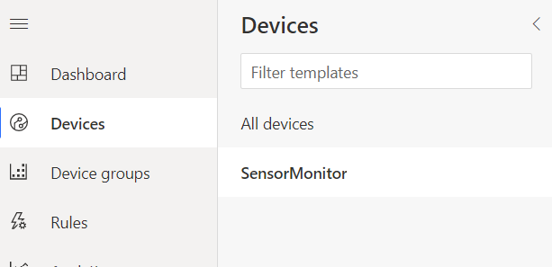

# Create App using IoT Central

[Azure IoT Central](https://docs.microsoft.com/en-us/azure/iot-central/core/overview-iot-central) is an IoT application platform that allows us interact with the cloud services.

IoT central has a user friendly UI that allows us monitor device conditions, create rules, and manage millions of devices easily.

## Create IoT Central Application from Portal

1. Log in into your [Azure Portal](http://portal.azure.com/).

1. Click on **+ Create a new resource**.

   

1. Search `IoT Central` and click on **IoT Central Application**. Then click on **Create**.
   

1. Fill in the details for the IoT App.

    i. Give you app a name such as `lab1sensor`.

    ii. Select your subscription.

    iii. Create a new resource group for the whole lab. In this case I have named it `Lab1`.

      > Resource groups are logical groupings of Azure services, allowing you to manage all the services for a particular application or project together. At the end of this workshop this Resource Group will be deleted, deleting all the services created.

    iv. Select **Standard 1** for the Pricing plan.

    v. In this case we are going to create the app from scratch, so we chose **custom application** in Template.

    vi. Select you location.

    vii. Click on create.

    

1. After that your IoT Central app will start the deployment. Once it is finished, just click on **Go to Resource**.

   

   To access the IoT Application Dashboard just press on the **IoT Central Application URL** hyperlink.

   

## Create a Device Template

Azure IoT Central can work with multiple types of device, and multiple devices per device type. Device types are defined using templates - these specify the capabilities of the device including the telemetry that can be received from the device, and commands that can be sent to it.

The environment sensor captures temperature, humidity, air pressure, soil moisture and light conditions. You will need to define a template that has these values on it, so they can be received from the Pi.

1. From the left panel select **Device Template**. Then click on **+ New**.

   

1. Select the **IoT Device** template.

   

1. Select the **Next: Customize** button.

1. Select the **Next: Review** button.

1. Select the **Create** button.

1. Name the template `SensorMonitor`.

Once the template is created, you need to add capabilities to it. These are defined using **capability models**, which define the capabilities of all devices that will use this template. Capability models are made up of three parts:

* **Interfaces** - these are reusable collections of capabilities, and are grouped into three categories:

   1. **Telemetry** - actual values detected and sent by the device, for example in a thermostat it could be the current detected temperature

   1. **Properties** - settings on the device, for example in a thermostat it could be the desired temperature. These can be set by the device, or via Azure IoT Central and synced to the device.

   1. **Commands** - calls that can be made on the device, optionally passing data. For example in a thermostat it could be called by a mobile app to send a request to change the desired temperature.

* **Cloud properties** - these are properties set in Azure IoT Central against a device, but not synced to the device. For example a device could have a cloud property for the account name of the owner, the devices location, or the date it was last serviced.

* **Views** - these are dashboards for a device that can contain charts, data values and other information allowing you to visualize telemetry or send commands.

The environment sensor needs a capability model created, with an interface defined for the telemetry values being sent and a view to visualize these values.

1. Select the **Custom** capability model

## Add an interface

1. Add a new interface to the capability model by selecting the top level *Environment sensor* item in the menu and selecting **+Add interface**

   

1. Select **Custom**

   

This interface needs 5 telemetry values added to it for the temperature, pressure, humidity, soil moisture and light level. Telemetry values have the following properties:

* **Display name** - this defines what is shown on a view to display the value
* **Name** - this maps to the values being sent from the device
* **Capability type** - this defines what type of value this is, and includes some standard types such as temperature or pressure.
* **Schema** - this defines the data type for the value being received, such as an integer or a floating point number
* **Unit** - this defines the unit for know telemetry types, for example °C for temperatures.

1. Select the **+ Add capability** button to add new capabilities, and add the following five values:

   |  Display Name     | Name          | Capability Type | Semantic Type | Schema | Unit |
   | -------------     | ------------- | --------------- | ------------- | ------ | ---- |
   | Temperature       | temperature   | Telemetry       | Temperature   | Double | °C   |
   | Pressure          | pressure      | Telemetry       | Pressure      | Double | kPa  |
   | Humidity (%)      | humidity      | Telemetry       | Humidity      | Double | %    |
   | Soil Moisture (%) | soil_moisture | Telemetry       | None          | Double | % |
   | Light Level (%)   | light_level   | Telemetry       | None          | Double | % |

   

## Add a view

1. Select **Views** from the menu.

   

1. Select **Visualizing the device**.

   

1. Set the view name to `Overview`. We will use this view to show the charts of the values recorded.

1. Drag *Temperature* from the *Telemetry* section onto the dashboard. This will add a graph showing the temperature recorded over the past 30 minutes to the dashboard. You can configure this in multiple ways using the control buttons on the top of the panel:

    Change the visualization to be a number of different chart types, or the last known value

    Change the size of the panel on the dashboard

    Configure the chart including legend, axis labels and the time range

   Configure the chart or last know value to your liking.

1. Repeat this for the other telemetry values. If you want to plot multiple telemetry values on the same chart use the check boxes to select multiple values and drag them together. You can add telemetry values multiple times to get multiple views over the data.

1. You can also customize the view with labels, markdown or images if desired.

1. Select the **Save** button from the top menu

   

1. You can create another view showing just the last value received if you want.

   Here is an example of how it can look like.

   

   

## Publish the device template

Before the device template can be assigned to a device, it needs to be published. Once published, any intefaces defined on it cannot be changed, instead a new version of the device template needs to be created.

1. Select the **Publish** button from the top-most menu.

   

1. Click on Publish.

   

## Create a device

1. Go to **Devices** > **SensorMonitor**.

   

1. Select **+ New**.

1. Set the **Device Name** to `Raspberry pi` and the **Devide Id** to `raspberry_pi`. Then Click on **Create**.

   

A new device should appear in the devices list.

### Get the device connection details

Each device has a set of connection details that will be used on the actual device to connect to Azure IoT Central and send telemetry.

1. Click on the Raspberry pi device you have just created.

1. Click on the `Connect` button located at the top right corner.

   

1. Take note of the **ID Scope**, **Device Id** and **Primary key**. You will need these values to send the data from the raspberry pi.

   

------------------

[Next Step](Send_data_to_IoTCentral.md): write the python code to send telemetry data to IoT Central.
