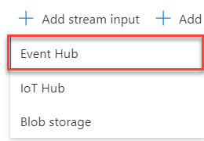

# Create Stream Analytics Job stream telemetry data from IoT Hub to Storage Account

In the [previous step](Create_storage_account.md) you have created the storage account to store the data. In this step, you will create a Stream Analytics Job to stream data into the storage account automatically.

## Azure Stream Analytics

[Azure Stream Analytics](https://azure.microsoft.com/services/stream-analytics/?WT.mc_id=agrohack-github-jabenn) provides real-time analytics on streams of data, allowing you to stream data from one service to another.

### Create the Stream Analytics Job

1. Log into your [Azure Portal](https://portal.azure.com/).

1. Click on **+ Create a Resource**.

    

1. Search `stream analytics` in the search bar and select **Stream Analytics job**. Then click on **Create**.

    

1. Fill in the details as follows:

    * Job name: write something like `streamData`.

    * Subscription: choose your subscription.

    * Resource group: choose `Lab1`.

    * Location: choose your location.

    * Streaming units: change it to one.

    

1. Click on **Create**.

### Add an input

1. On the left panel, under **Job Topology**, click on **Inputs**.

    

1. Click on `+ Add input stream` and then select **Event Hub**.

    

1. Complete the details as follows:

    * Input alias: `sensorData`.

    * Click on `Select Event Hub from your subscriptions`.

    * Subscription: select your subscription.

    * Event Hub Namespace: Select the Event Hub you have created earlier (`sensormonitoralba2020`).

    * Event Hub Name: Choose use existing. Then choose `Telemetry`.

    * Leave the rest as defaults.

        

### Add an output

1. On the left panel, under **Job Topology**, click on **Outputs**.

    

1. Click on **+ Add** and then select **Blob Storage/Lake Storage**.

    

1. Complete the details as follows:

    * Input alias: `data`.

    * Click on `Select storage from your subscriptions`.

    * Subscription: select your subscription.

    * Storage account: Select the Storage account you have created earlier.

    * Container: Click on **Use Existing** and select `sensordata`.

    * Path pattern: set it as `{date}/{time}`. JSON records are appended to a single JSON file, and setting this will cause a new file to be created each hour in a folder hierarchy based off year/month/day/hour.

    * Leave the rest as it is.

    

### Create Query

1. On the left panel, under **Job Topology**, click on **Query**.

    

1. Change the query to the following code:

    ```sql
    SELECT
        *
    INTO [data] FROM [sensorData]
    ```

    This will pass the all the data received from the Event Hubs as they are to the Storage account.

1. Click on **Test query**. You should see something like this:

    

1. Save the query.

    

### Start the job

1. Go to the overview tab on the left pannel.

    

1. Click on **Start**. It may take a few minutes to start the job.

    

    It may take a few minutes so be patient.

-----------------------

Now your IoT Central app telemetry data should be stored in the Blob container.

You can now try to create an application in [PowerApps](../PowerApps/) or move on to [scenario 2](../../Lab2_WaterYourPlant/).
