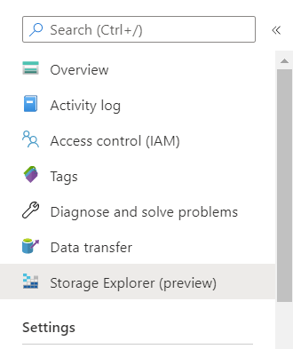

# Create Storage Account to store sensor data

In the [previous step](./Python_code.md), you have established a connection between your Raspberry Pi and IoT Hub. Now you will create a storage account to store all the telemetry data into a table.

## Azure Table Storage

[Azure Table Storage](https://azure.microsoft.com/services/storage/tables/) allows you to store up to petabytes of structure data, and access them using a key-value approach.

Azure has a concept of [storage accounts](https://docs.microsoft.com/azure/storage/common/storage-account-overview/?WT.mc_id=agrohack-github-jabenn), which wrap a range of storage services including file, table and blob.

If you already have an existing storage account, you can skip this step go to **Create a table**.

### Create a Storage Account

1. Log into your [Azure Portal](https://portal.azure.com/)

1. Click on **+ Create a Resource**.

    

1. Search `storage account` in the search bar and select **Storage account - blob, file, table, queue**. Then click on **Create**.

    

1. Fill in the Project details as follows:

    * Subscription: choose your own subscription.

    * Resource group: choose `sensorMonitor`.

    * Storage account name: choose something like `sensorMonitor`.

    * Region: Choose your region.

    * Performance: choose standard.

    * Account kind: `Storage (general purpose 1)`.

    

1. Once you are done click on **Review + create**. And the click on create.

1. Wait for the deployment to be finished. After that select **Go to resource**.

### Create a table

1. On the Left panel, go to **Storage Explorer (preview)**.

    

1. Right click on *Tables* > *Create table*. Name the table `data`.

    

### Get the connection string

1. On the left panel, go to *Settings* > *Access keys*.

    

1. Copy the **Connection string** from key 1. You will need it when creating your Azure Function.

---------------

Next step: [Create stream analytics](Create_stream_analytics.md) to tranfer the events from the IoT Hub to the table in the Storage account.
