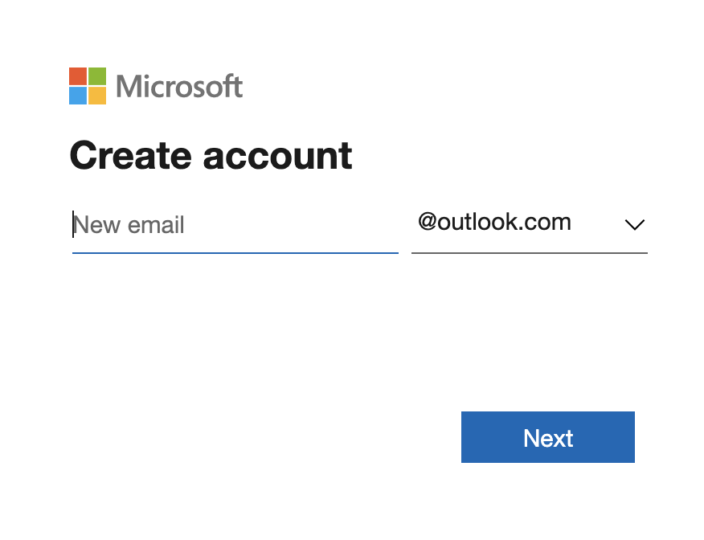
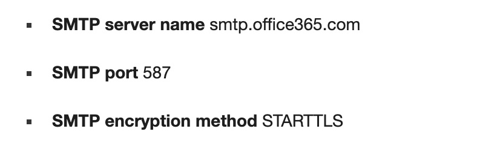

# **2. Set up an alarm system**

## Start with a email account

1. Register a new microsoft email account



2. Check for information about **Outlook mail SMTP**

- SMTP server name: smtp.office365.com
- SMTP Port TLS: 587



## Write the code

```python
import RPi.GPIO as GPIO
import time
import smtplib
from email.mime.text import MIMEText
# import libraries for SMTP and email related functions

def main():

    sensor1 = seeed_dht.DHT("11", 12)
    # sensor1: DHT11

    from grove.helper import SlotHelper
    sh = SlotHelper(SlotHelper.ADC)
    pin = sh.argv2pin()
    sensor2 = GroveMoistureSensor(pin)
    # sensor2: moisture sensor

    alarm_state = False
    # create a default alarm state

    from_email_addr = 'sender_email@outlook.com'
    from_email_password = 'sender_email_password'
    to_email_addr = 'receiver_email@outlook.com'
    # set up the email credentials

    body = 'Farmbeats Alert: Your plants are thirsty!!'
    msg = MIMEText(body)
    # set email message

    msg['From'] = from_email_addr
    msg['To'] = to_email_addr
    # set sender and recipient

    msg['Subject'] = 'FARMBEATS ALERT!!!'

    while True:
        humi, temp = sensor1.read()
        m = sensor2.moisture
        if 0 <= m and m < 300 and temp > 25:
            alarm_state = True
            print('Alarm ON')

        if alarm_state == True:
            server = smtplib.SMTP('smtp.outlook.com', 587)
            # connect to server and get ready to send email
            # edit above lines with your email provider's SMTP server details
            server.starttls()
            # comment out this line if provider does not use TLS
            server.login(from_email_addr, from_email_password)
            server.sendmail(from_email_addr, to_email_addr, msg.as_string())
            server.quit()
            print('Email sent')
            alarm_state = False
```
The monitor email account will send alarm directly to receiver as it reaches the water threshold.

### Breakdown the code

This Python file contains code to define sensors, configure email sender &receiver and set up telemetry alarm message.

```python
import RPi.GPIO as GPIO
import time
import smtplib
from email.mime.text import MIMEText
```
This code import libraries for SMTP and email related functions.

```python
def main():

    sensor1 = seeed_dht.DHT("11", 12)
    # sensor1: DHT11

    from grove.helper import SlotHelper
    sh = SlotHelper(SlotHelper.ADC)
    pin = sh.argv2pin()
    sensor2 = GroveMoistureSensor(pin)
    # sensor2: moisture sensor

    alarm_state = False
    # create a default alarm state
  ```
At the beginning of the main function, define all the Grove sensors and create an *Alarm State*. Set the *Alarm State* to *False* as its default state.

```python
    from_email_addr = 'sender_email@outlook.com'
    from_email_password = 'sender_email_password'
    to_email_addr = 'receiver_email@outlook.com'
    # set up the email credentials

    body = 'Farmbeats Alert: Your plants are thirsty!!'
    msg = MIMEText(body)
    # set email message

    msg['From'] = from_email_addr
    msg['To'] = to_email_addr
    # set sender and recipient

    msg['Subject'] = 'FARMBEATS ALERT!!!'
```
Then set up credentials for email sender and receiver. Editting alarm message and its subject title in *body* and *msg[subject]*, respectively.

```python
    while True:
        humi, temp = sensor1.read()
        m = sensor2.moisture
        if 0 <= m and m < 300 and temp > 25:
            alarm_state = True
            print('Alarm ON')

        if alarm_state == True:
            server = smtplib.SMTP('smtp.outlook.com', 587)
            # connect to server and get ready to send email
            # edit above lines with your email provider's SMTP server details
            server.starttls()
            # comment out this line if provider does not use TLS
            server.login(from_email_addr, from_email_password)
            server.sendmail(from_email_addr, to_email_addr, msg.as_string())
            server.quit()
            print('Email sent')
            alarm_state = False
```
In this part of the code, the loop continuously checks the reading data by comparaing readings with the threshold we set. If the data is below the threshold, *Alarm State* will be switched on and alarm message we set before will be sent to email receiver.

**Code for print statement:**

**Code for emailing:**

**Code for LED light:**