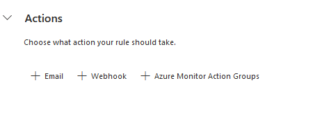
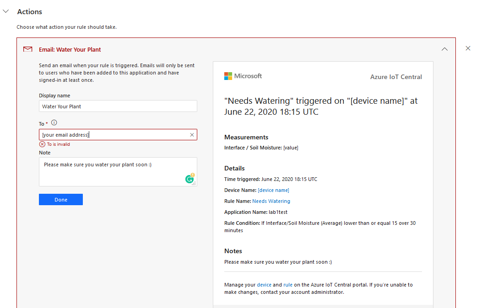
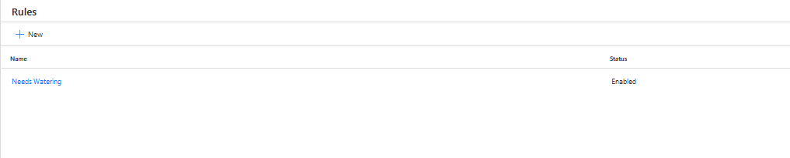

# Create a rule in IoT Central

So far we have seen how IoT Central can be used to manage and connect IoT devices to other Azure services by using the data export feature, but did you know that IoT Central can also be used to monitor your connected devices? By creating **Rules** and **Actions**, you will be able to trigger an event depending on the telemetry values being received from your device. 

This lab goes through the steps of creating a new rule in IoT Central Application that notifies the user by email when the soil moisture is below a certain level.

1. Click on **Rules**, which is found in the sidebar of your IoT Central Application dashboard

    

    Here you will be able to create and edit rules to monitor your devices. Rules are evaluated based on device telemetry and trigger customizable actions.

1. Name your rule whatever you would like. Here, we have given it the name `Needs Watering`. Then, select the device that you would like to create the rule for. For the purposes of this lab, choose the `IrrigationAlert` device.

    

1. Next, define the rule conditions that trigger the notification. In this case we are taking the average value of soil moisture every 30 minutes, and then comparing this value to 15. If the average soil moisture is below 15, we consider that the plant needs to be watered.

    

1. Next, customise the rule action. You can now choose what happens when the conditions are met. Click on **+Email**

    

1. You can now customise the email that will be sent. Choose a **Display name** and enter your email address. Optionally, you can include a note. You will see the preview of the email on the right that updates as you enter information. An example is shown below.

    

1. Click on **Done** once you are done customising the email.

1. Click on **Save**

1. Verify that you can see your new rule listed in the rules section of your dashboard.

    

------------------

**Test yourself**: There are many ways that you can configure conditions
You can choose from sum, average, minimum, maximum .....

**Test youself**: Try creating rules for different sensor data. For example, send a notification when the light level is below 30%

**Challenge**: Use webhooks

---------------------

Next Step: [Implement an autoirrigation system](../Automated_irrigation)
