# Create an Azure Function Application

This lab will teach clients and students how to use an Azure function application to process the sensor data collected from the local device. This includes setting up a real-time data pipeline with Stream Analytics as done previously for [steaming sensor data into blob storage](../../Lab1_MonitorYourPlant/IoTCentral/Create_stream_analytics.md).

## Azure Functions

Azure Functions is an event driven serverless compute platform, essentially a way to define small blocks of code that are triggered by events such as a web request, data changes in storage or events being put onto an Azure Event Hub. Multiple different languages could be used, including C#, F#, Java, JavaScript and Python, therefore it is quite flexible for developments.

Azure Stream Analytics can call Azure Functions in response to streaming data, either individual messages or an aggregation across a time window.
 
In this lab, the moisture reading from sensor will be compared against a defined threshold level. If it is lower than the threshold level, it means that the plant needs watering. Events are coming in every 60 seconds. The moisture level instead, doesn't need to be checked that often since it does not valid much within a certain period of time, it will therefore be checked every 5 minutes.

The Azure Function to be created will be triggered by a web request, called from Azure Stream Analytics which we went through in Lab1.

### Configure Visual Studio Code for Azure Functions development

To build, test and deploy Azure Functions in Python using Visual Studio Code, you will need to install the `Azure Functions` extension.

1. Launch Visual Studio Code. You will be developing locally, so close any remote development sessions to the Raspberry Pi that you have open.

1. Select the Extensions tab from the left hand menu, or select *View -> Extensions*

   

1. Search for `Azure Functions` and install the *Azure Functions* extension from Microsoft by selecting **Install**.

   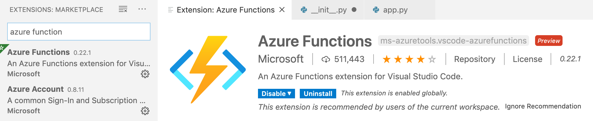

### Create a new Azure Functions project

1. Create a new folder for the Azure Functions project called `MoistureTrigger`

1. Launch Visual Studio Code and open the new folder using either the **Open Folder** button in the Explorer, or by selecting *File -> Open..*

1. From Visual Studio Code, launch the command palette

   * On macOS, press command+shift+p
   * On Windows or Linux, press ctrl+shift+p

1. Search for `Azure Functions: Create New Project` and select it

   

1. Select the folder to create the project, pick the currently open folder.

   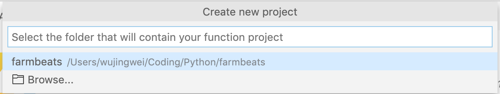

1. Select **Python** for the function project language, the function then will be created under Python Virtual environment.

   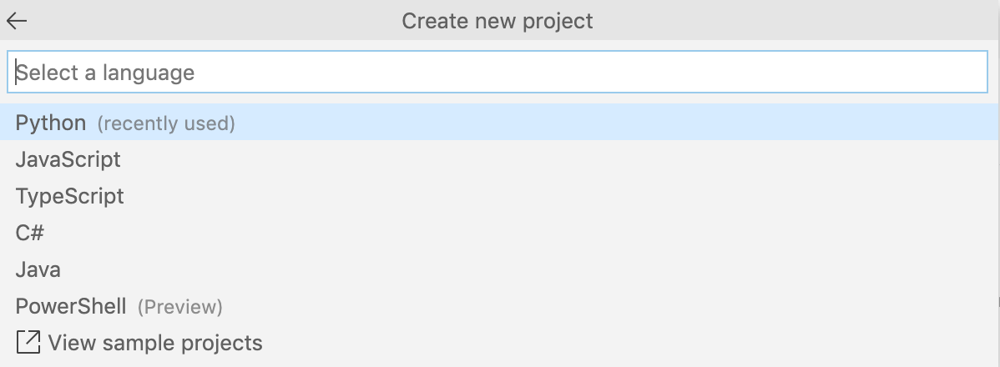

1. The function project will be created with a single trigger. Select the *Http Trigger* option to have this function triggered by a web request.

   

1. Name the function `SoilMoistureCheck`

   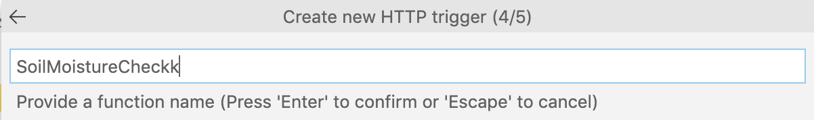

1. Set the function authorization level to `Function`. This means it can only be called using a key either as a header or a query string. Without the key the function cannot be called.

   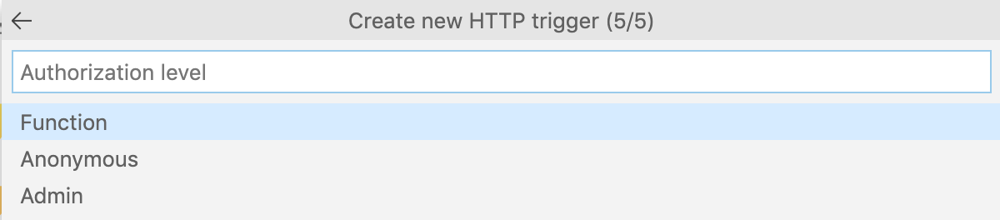

The project and virtual environment will be created which will take a few seconds.

### Write the code for the function

In this step, the function just needs to exist so that it can be called by Azure Stream Analytics, along with some logging. In a later step more code will be added to it to check weather and execute an Azure IoT Central command.

1. Open the `__init__.py` file from the `SoilMoistureCheck` folder if it's not already open

1. Change the `main` function to the following:

    ```python
    def main(req: func.HttpRequest) -> func.HttpResponse:
        # Log the function was called
        logging.info('Python HTTP trigger function processed a request.')

        # Return a 200 status
        return func.HttpResponse(f"OK")
    ```

1. Save the file

### Test the function


1. Select the debugger from the left-hand menu, or select `View -> Debug`

   

1. Click on the **Start Debugging** button from the top of the debug pane, which is a green play triangle ▶️.

   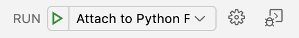

1. The Azure Functions runtime will launch and host the function. When it is running you will see the list of functions inside the app in the terminal containing the single Http trigger as shown below.

   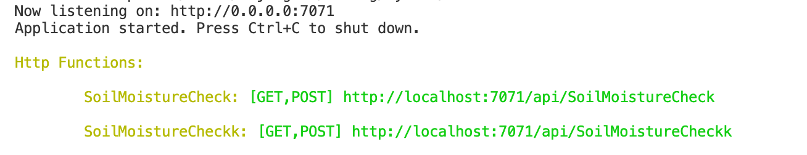

1. Test the trigger by opening [http://localhost:7071/api/SoilMoistureCheck](http://localhost:7071/api/SoilMoistureCheck) in your web browser. In the terminal in Visual Studio Code you will see the call being made, and the browser will show the output of `OK`.

   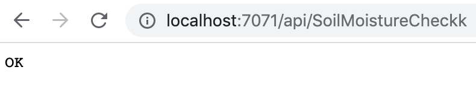

1. After testing the function, detach from the functions host debugger by selecting the **Disconnect** button from the debug toolbar, which is the red button on the right hand side of the bar.

   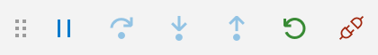


## Deploy the function to Azure

Azure Stream Analytics needs to be able to access the URL for the function and therefore to be able to run it. This means it cannot call functions running locally, so the function will need to be published to Azure to make it publicly available and therefore callable from Azure Stream Analytics.

1. From Visual Studio Code, launch the command palette

   * On macOS, press command+shift+p
   * On Windows or Linux, press ctrl+shift+p

1. Search for `Azure Functions: Deploy to Function App` and select it

   

1. Select `+ Create new Function App in Azure... (Advanced)`. There are two options with this name, select the one marked as `Advanced`. The Advanced option gives more control including adding the Function App to the existing Resource Group.

   

1. Give the Function App a name that is globally unique, for example `imperialfarmbeats`.

   

1. Select the latest *Python 3.7* runtime

   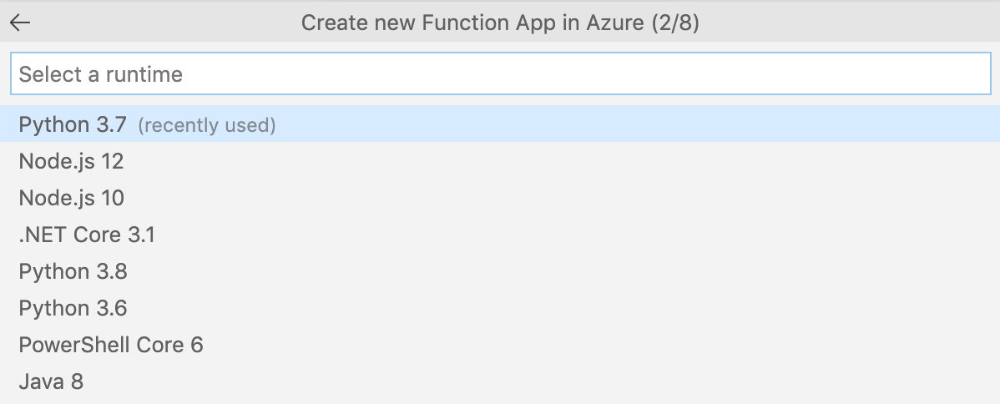

1. Select `Consumption` for the app service plan. This plan means you only pay based off the function app usage, with a generous free tier.

   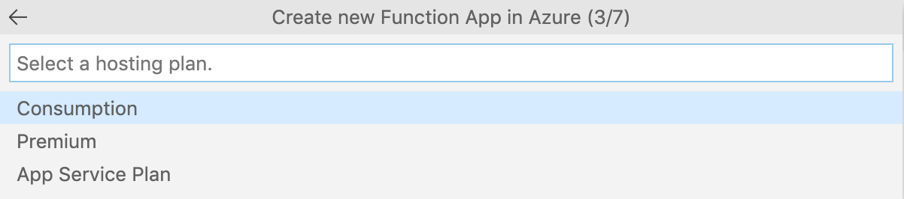

1. Select the `ImperialFarmbeats` Resource Group

   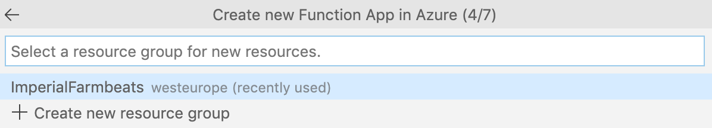

1. Select the storage account that was created earlier for the data export or create a new storage account. This storage account is used to save the files needed for the function app.

   

1. Select *Create new Application Insights Resource*. Application Insights allows you to monitor the Function App. Accept the default Application Insights name.

   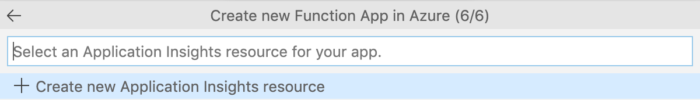
   
1. Name the new Application Insights resource.

   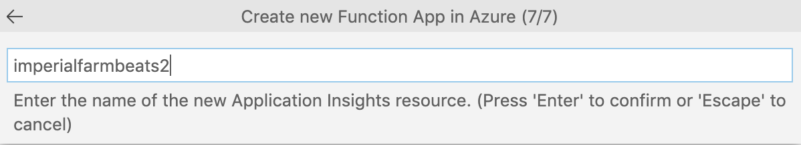

1. The Function App will be created and your code deployed. This will take a few seconds and a notification will pop up when complete.

1. Then select the Azure tab from the left-hand menu.

   

1. In the *Functions* section, expand your subscription to see all your Function Apps. Expand the newly created function app to see all functions you created.

   

1. Right-click on the *SoilMoistureCheck (HTTP)* function and select *Copy Function Url*.

1. Paste this URL into a browser and test the function is working.

-------------

Next step: [Create Stream Analytics job to feed the IoT Central data to the Function](Create_stream_analytics.md)
