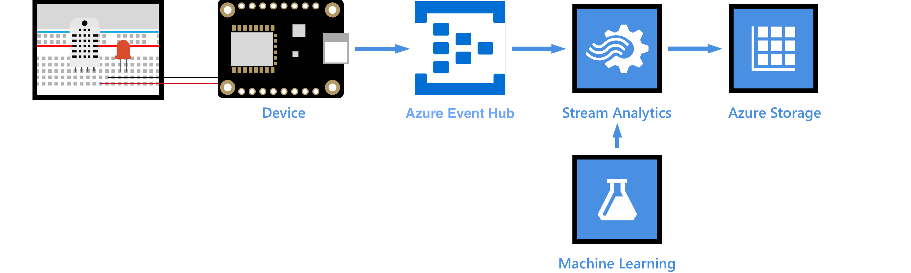
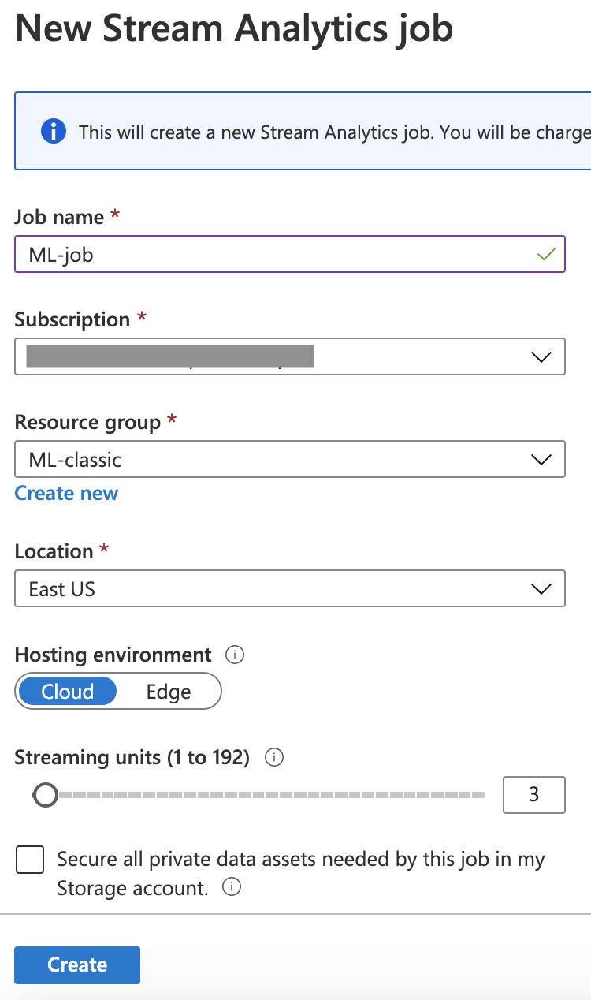
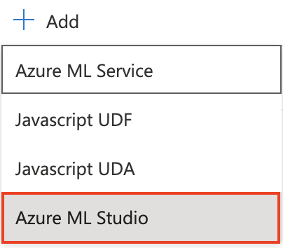

# Weather forecast using the sensor data 



Machine learning is a technique of data science that helps computers learn from existing data to forecast future behaviors, outcomes, and trends. Azure Machine Learning is a cloud predictive analytics service that makes it possible to quickly create and deploy predictive models as analytics solutions.

## Deploy the weather prediction model as a web service

In this section you get the weather prediction model from the Azure AI Library. Then you add an R-script module to the model to clean the temperature and humidity data. Lastly, you deploy the model as a predictive web service.


### Get the weather prediction model

1. Go to the [weather prediction model page](https://gallery.azure.ai/Experiment/Weather-prediction-model-1)

    
    
1. Click **Open in Studio (classic)** to open the model in Microsoft Azure Machine Learning Studio (classic).

    

### Add an R-script module to clean temperature and humidity data

Add an R-script module to the weather prediction model that removes any rows that have data values for temperature or humidity that cannot be converted to numeric values.

1. On the left-side of the Azure Machine Learning Studio window, click the arrow to expand the tools panel. Enter "Execute" into the search box. Select the **Execute R Script** module.

    

1. Drag the **Execute R Script** module near the **Clean Missing Data** module and the existing **Execute R Script** module on the diagram. Delete the connection between the **Clean Missing Data** and the Execute R Script modules and then connect the inputs and outputs of the new module as shown.

    

1. Select the new **Execute R Script** module to open its properties window. Copy and paste the following code into the **R Script** box.

    ```R
    # Map 1-based optional input ports to variables
    data <- maml.mapInputPort(1) # class: data.frame

    data$temperature <- as.numeric(as.character(data$temperature))
    data$humidity <- as.numeric(as.character(data$humidity))

    completedata <- data[complete.cases(data), ]

    maml.mapOutputPort('completedata')
    
    ```
    The properties window should look similar to the following:
    
    
    
    
### Deploy predictive web service

Now we validate the model, set up a predictive web service based on the model and then deploy the web service.

1. Click **Run** to validate the steps in the model. This step might take a few minutes to complete.

    

1. Click **SET UP WEB SERVICE > Predictive Web Service**. The predictive experiment diagram opens.

    

1. In the predictive experiment diagram, delete the connection between the **Web service input** module and the **Weather Dataset** at the top. Then drag the **Web service input** module somewhere near the **Score Model** module and connect it as shown:

    
    
1. Click **RUN** to validate the steps in the model.

1. Click **DEPLOY WEB SERVICE** to deploy the model as a web service.

1. On the dashboard of the model, download the **Excel 2010 or earlier workbook** for **REQUEST/RESPONSE**.
    
    
    
1. Open the Excel workbook, make a note of the **WEB SERVICE URL** and **ACCESS KEY**. (You will need these later)
    

## Add a consumer group to your Event hub

[Consumer groups](https://docs.microsoft.com/en-us/azure/event-hubs/event-hubs-features#event-consumers) provide independent views into the event stream that enable apps and Azure services to independently consume data from the same Event Hub endpoint. In this section, you add a consumer group to your Event hub's built-in endpoint. We use this later in the tutorial to pull data from the endpoint.

To add a consumer group to your Event hub, follow these steps:

1. In the [Azure portal](https://portal.azure.com/#home), open your Event Hubs Namespace and go into the event hub you created previously.

    
    
1. Select **+ Consumer Group** and name it `ml-consumer-group`.

    
    

## Create, configure, and run a Stream Analytics job

### Create a Stream Analytics job

1. Create a new Stream Analytics Job in your resource group.

1. Fill in the details for the Stream Analytics Job:
    
    1. Name the job `ML-job`
    
    1. Select your Azure subscription
    
    1. For the *Resource group*, select your own resource group
    
    1. Select a *Location* closest to you, the same location you used in the previous step to create the resource group and event hubs.
    
    1. Leave the rest of the options as the defaults

    1. Select **Create**
    
    

1. Once the deployment has completed, select the **Go to resource** button.    

### Set an input for the Stream Analytics job

1. From the Stream Analytics Job, select *Job topology -> Inputs* from the left-hand menu

    

1. Select **+ Add stream input**, then select **Event Hub**

    
    
1. Fill in the input details

   1. Set the alias to be `telemetry`

   1. Select *Select Event Hub from your subscriptions*

   1. Select your subscription and Azure Event Hubs Namespace

   1. Select *Use Existing* for the *Event hub name*

   1. Select the `telemetry` event hub
   
   1. Select the consumer group you created.

   1. Leave the rest of the options as the defaults

   1. Select **Save**

    
   

### Set an output for the Stream Analytics job

1. From the Stream Analytics Job, select *Job topology -> Outputs* from the left-hand menu

1. Select **+ Add**, then select **Blob storage**

1. Fill in the output details

   1. Set the alias to be `ml-job-output`

   1. Select *Select storage from your subscriptions*

   1. Select your subscription

   1. Select the storage account you created in the previous part

   1. Select *Use Existing* for the *Container*

   1. Select the `environmentdata` container

   1. Set the *Path pattern* to `{date}/{time}`.

   1. Leave the rest of the options as the defaults

   1. Set Event serialization format: to *CSV*
   
   1. Select **Save**
   
   

### Add a function to the Stream Analytics job to call the web service you deployed

1. Under Job Topology, click Functions > Add > Azure ML Studio.

   

1. Enter the following information:

    1. **Function Alias**: Enter `machinelearning`.
    
    1. Select *Provide Azure Machine Learning function settings manually*
    
    1. **URL**: Enter the WEB SERVICE URL that you noted down from the Excel workbook.
    
    1. **Key**: Enter the ACCESS KEY that you noted down from the Excel workbook.
    
    
    
### Configure the query of the Stream Analytics job

1. Under **Job Topology**, click **Query**.
   
1. Replace the existing code with the following code:

    ```SQL
    WITH machinelearning AS (
        SELECT EventEnqueuedUtcTime, temperature, humidity, machinelearning(temperature, humidity) as result from [YourInputAlias]
    )
    Select System.Timestamp time, CAST (result.[temperature] AS FLOAT) AS temperature, CAST (result.[humidity] AS FLOAT) AS humidity, CAST (result.[scored probabilities] AS FLOAT ) AS 'probabalities of rain'
    Into [YourOutputAlias]
    From machinelearning
    ```
    
    Replace [YourInputAlias] with the input alias of the job.
    
    Replace [YourOutputAlias] with the output alias of the job.
    
3. Click **Save query**.

### Run the Stream Analytics job

In the Stream Analytics job, click Start > Now > Start.

## View the weather forecast

Run your IoT device (Raspberry Pi) to start collecting and sending temperature and humidity data to your IoT hub. For each message that your IoT hub receives, the Stream Analytics job calls the weather forecast web service to produce the chance of rain. The result is then saved to your Azure blob storage. You can view these results in your storage account.

1. Go to your storage account used in this experiment.

1. Search for *Containers*

    
    
1. Select the container used in this experiment.

1. Go into the folder that is named as the current year the data has been streaming. (As mentioned before *Path pattern* which we entered as `{date}/{time}` causes a new file to be created each hour in a folder hierarchy based off year/month/day/hour in which the records are stored.) Find the data that is currently streaming going deep into the folders.

1. Then select the latest csv file and select edit. You can then see the **probabilities of rain** based on **temperature** and **humidity** data.

    
    
<hr>

## Summary

You’ve successfully used Azure Machine Learning to produce the chance of rain based on the temperature and humidity data that your Event hub receives.

-----------------

[Check what you learned!](Knowledge_Check.md)
