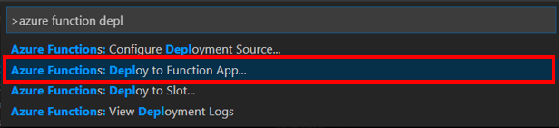
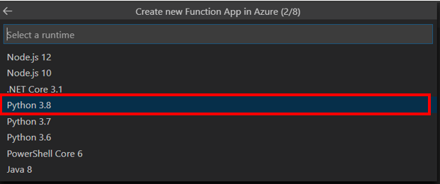

# Create Azure Function to get data via API

In the [previous step](Create_stream_analytics.md) you have created a Stream Analytics Job to stream data into the storage account. In this step, you will create a function to access the data in the storage account via API.

## Azure Functions

[Azure Functions](https://azure.microsoft.com/services/functions/) is an event driven serverless compute platform, essentially a way to define small blocks of code that are triggered by events such as a web request, data changes in storage or events being put onto an Azure Event Hub. They can be written in a multitude of different languages including C#, F#, Java, JavaScript and Python.

Azure Stream Analytics can call Azure Functions in response to streaming data, either individual messages or an aggregation across a time window.

### Configure Visual Studio Code for Azure Functions development

To build, test and deploy Azure Functions in Python using Visual Studio Code, you will need to install a couple of extensions.

1. Launch Visual Studio Code. You will be developing locally, so close any remote development sessions to the Raspberry Pi that you have open.

1. Select the Extensions tab from the left hand menu, or select *View > Extensions*.

   )

1. Search for `Python` and install the *Python* extension from Microsoft by selecting **Install**.

   

   > There are a number of Python extensions available, so ensure you install the one from Microsoft.

1. Search for `Azure Functions` and install the *Azure Functions* extension from Microsoft by selecting **Install**.

   

### Create a new Azure Functions project

Azure Functions can be created inside Visual Studio Code, or via the Azure CLI.

#### Create a new Azure Functions project in Visual Studio Code

1. Create a new folder for the Azure Functions project called `GetData`.

1. Launch Visual Studio Code and open the new folder using either the **Open Folder** button in the Explorer, or by selecting *File > Open*.

1. From Visual Studio Code, launch the command palette.

   * On macOS, press command+shift+p.
   * On Windows or Linux, press ctrl+shift+p.

1. Search for `Azure Functions: Create New Project` and select it.

   

1. Select the folder to create the project in. The currently open folder will be one of the options, so select it.

   

1. Select **Python** for the function project language.

   

1. The function will be created using a Python Virtual environment, so select the Python version to use. Select the latest version of Python 3 that you have installed.

   

1. The function project will be created with a single trigger. Select the *Http Trigger* option to have this function triggered by a web request.

   

1. Name the function `getData`

   

1. Set the function authorization level to `Anonymous`. This means anyone can use the function.

   

The project and virtual environment will be created. This will take a few seconds.

#### Test the function

In this step, the function just needs to exist so that it can be called by Azure Stream Analytics, along with some logging. In a later step more code will be added to it to get the data from the table in the Storage Account.

1. Open the `__init__.py` file from the `getData` folder if it's not already open

1. Change the `main` function to the following:

    ```python
    def main(req: func.HttpRequest) -> func.HttpResponse:
        # Log the function was called
        logging.info('Python HTTP trigger function processed a request.')

        # Return a 200 status
        return func.HttpResponse(f"OK")
    ```

1. Save the file. If you don't want to have to remember to save files, you can turn on *Auto Save* by selecting *File > Auto Save*.

1. From the terminal activate the Python Virtual Environment

   1. On Windows use the following command

      ```cmd
      .venv\Scripts\activate.bat
      ```

   1. On macOS use the following command

      ```sh
      source ./.venv/bin/activate
      ```

1. Install the require pip packages with the following command

   ```sh
   pip install -r requirements.txt
   ```

1. Launch the function with the following command

   ```sh
   func start
   ```

1. The Azure Functions runtime will launch and host the function. When it is running you will see the list of functions inside the app in the terminal containing the single Http trigger.

   

1. Test the trigger by opening [http://localhost:7071/api/getData](http://localhost:7071/api/SoilMoistureCheck) in your web browser. In the terminal in Visual Studio Code you will see the call being made, and the browser will show the output of `OK`.

   

1. When you have finished testing the function, detach from the functions host debugger by pressing ctrl+c.

### Deploy the function to Azure

Azure Stream Analytics needs to be able to access the URL for the function to be able to run it. This means it cannot call functions running locally, so the function will need to be published to Azure to make it publicly available and therefore callable from Azure Stream Analytics.

The function can be deployed from Visual Studio code, or the Azure CLI.

#### Deploy the function from Visual Studio Code

1. From Visual Studio Code, launch the command palette

   * On macOS, press command+shift+p
   * On Windows or Linux, press ctrl+shift+p

1. Search for `Azure Functions: Deploy to Function App` and select it

   

1. If you have multiple Azure subscriptions a list of them will be shown, so select the correct one

1. Select `+ Create new Function App in Azure... (Advanced)`. There are two options with this name, one marked as `Advanced`. Select the one that is marked as `Advanced`. The Advanced option gives more control including adding the Function App to the existing Resource Group.

   

1. Give the Function App a name that is globally unique, so include things such as the date or your name, for example `sensormonitoralba2020`. To make it easier, name it the same as your Azure IoT Central app and storage account.

   

1. Select the latest Python 3 runtime that is available

   

1. Select `Consumption` for the app service plan. This plan means you only pay based off the function app usage, with a generous free tier.

   

1. Select the `sensorMonitor` Resource Group

1. Select the storage account that was created earlier for the data export. This storage account is used to save the files needed for the function app.

1. Select *Create new Application Insights Resource*. Application Insights allows you to monitor the Function App.

   

1. Accept the default Application Insights name.

1. The Function App will be created and your code deployed. This will take a few seconds and a notification will pop up when complete.

1. Select the Azure tab from the left-hand menu

   

1. In the *Functions* section, expand your subscription to see all your Function Apps. Expand the newly created function app to see all functions.

1. Right-click on the *getData (HTTP)* function and select *Copy Function Url*.

1. Paste this URL into a browser and test the function is working.

### Write the code for the function

Now that the function is working we need to connect it to the table in the Storage account to get the data.

#### Binding to the storage account

1. Open the `function.json` files inside the `getData` folder.

1. Inside the **Bindings** array, add the following object.

   ```json
   {
      "name": "messageJSON",
      "type": "table",
      "tableName": "data",
      "connection": "AzureWebJobsStorage",
      "direction": "in"
    }
    ```

   This will allow you access the table named **data**, by using the variable `messageJSON`. The source is specified in the `AzureWebJobsStorage` variable inside the `local.settings.json` file.

1. Open the `local.settings.json` file. Copy your storage account primary connection string.

   ```json
   {
      "IsEncrypted": false,
      "Values": {
         "AzureWebJobsStorage": "<Storage account connection string>",
         "FUNCTIONS_WORKER_RUNTIME": "python"
      }
   }
   ```

1. Open the `__init__.py` file. Modify the code as below:

   ```python
   import logging, json
   import azure.functions as func

   def main(req: func.HttpRequest, messageJSON) -> func.HttpResponse:
      logging.info('Python HTTP trigger function processed a request.')

      # Get all the table
      message = json.loads(messageJSON)

      # Get the top parameter
      top = req.params.get('top')
      logging.info('top parameter: %s' %top)

      if top:
         top = int(top)

      # Get the partitionkey parameter
      partitionkey = req.params.get('partitionkey')
      logging.info('partition key parameter: %s' %partitionkey)

      if partitionkey:
         message = (x for x in message if x.PartitionKey == partitionkey)
         if top:
               #if partitionkey and top are received parameters
               message = message[-top:]
      else:
         if top:
               # no partitionkey, but top
               message = message[-top:]

      message = json.dumps(message)
      # no parameter defined.
      return func.HttpResponse(f'{message}')
   ```

   Everytime we get the data from the table we can specify two parameters: `partitionkey` and `top`.

   `partitionkey` is used in case you want to get data from a specific device. `top` is used to get the last message. For example, if top is 10, we will get the last 10 messages.

1. Test that the function works by running `func start` in the terminal.

1. To deploy and update the function in Azure, go to the Azure tab in the left pannel in VS Code. Right click on the function and select **Deploy to Function App**.

   

1. Click on **Deploy** to overwrite the previous function.

   

#### Test from Azure Portal

Now if you want, you can also test it from the Azure Portal and check that the parameters get the correct data.

1. Log into your [Azure Portal](portal.azure.com).

1. On the left pannel go to **Function Apps**.

   

1. Click on you Function App. Then go to *Functions* > *Functions* on the left pannel.

   

1. Click on `getData`. On the left pannel select **Code + Test** under the Developer section.

   

1. Then click on **Test/Run**.

1. On the Input tab:

   * HTTP Method: select **GET**.

   * Key: leave it as it is.

   * Query: you can add parameters to your query. In our code, we only take into account the parameters `partitionkey` and `top`.

   * Click on run.

   

1. You should receive a `200 Respone`, and some data from the table as the HTTP response content.

   

------------------

Next step: [Create App in Power Apps](Create_PowerApps.md).
