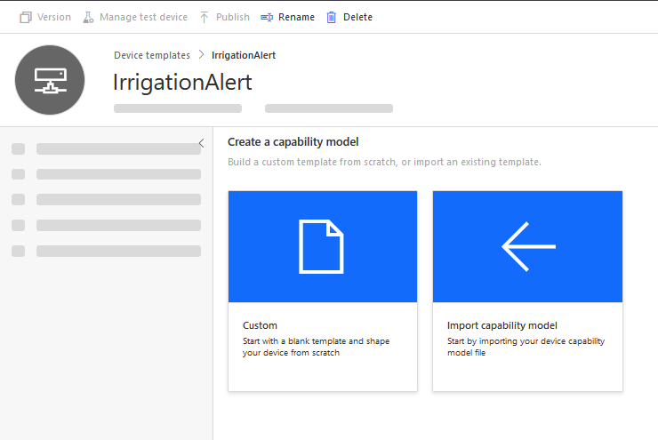
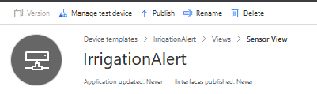
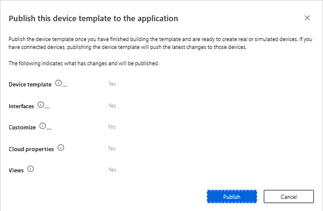
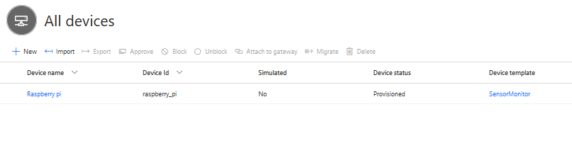
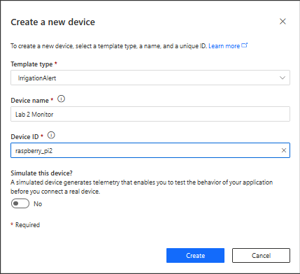
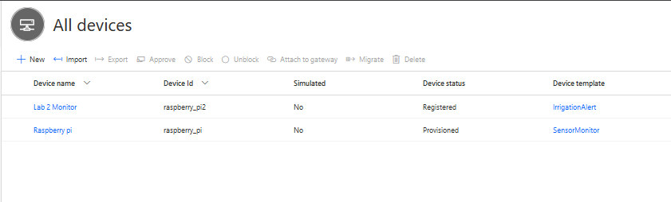

# Create a new Device Template in IoT Central

You have already created an IoT Central Application in [Lab 1](../../Lab1_MonitoryourPlan/IoTCentral/Create_app_IoTCentral.md). For this scenario, you will need to add a new interface to your device template so that a command to trigger the alert system can be sent to the device.

## Create the device template

We have previously created a device template called **SensorDevice** that receives temperature, humidity, air pressure, soil moisture and light conditions. For this lab, you will need to define a new device template that has the same telemetry capabilities, as well as a new command that communicates to the raspberry pi when the plant needs to be watered.

1. From the left panel select **Device Template**. Then click on **+ New**.

   

1. Select the **IoT Device** template.

   

1. Select the **Next: Customize** button.

1. Name the template `IrrigationAlert`.

   

1. Select the **Next: Review** button.

1. Select the **Create** button.

   

## Create the Capability Model

Once the template is created, you need to add capabilities to it as you have done previously. These are defined using **capability models**, which define the capabilities of all devices that will use this template. 

1. Select the **Custom** capability model]

   

1. Click on **+Add interface**

   

1. Select **Custom** interface

   

1. Select the **+ Add capability** button to add new capabilities, and add the following values:

   |  Display Name     | Name          | Capability Type | Semantic Type | Schema | Unit |
   | -------------     | ------------- | --------------- | ------------- | ------ | ---- |
   | Temperature       | temperature   | Telemetry       | Temperature   | Double | °C   |
   | Pressure          | pressure      | Telemetry       | Pressure      | Double | kPa  |
   | Humidity (%)      | humidity      | Telemetry       | Humidity      | Double | %    |
   | Soil Moisture (%) | soil_moisture | Telemetry       | None          | Double | % |
   | Light Level (%)   | light_level   | Telemetry       | None          | Double | % |

1. At this point. you will need to add an additional capability of the type **Command** to your model. The commnad interface allows you to call device commnads from IoT Central.

   This will help communicate to the device that the plant needs to be watered. In this case, the command `needs_watering` can be sent to your device to trigger an alert.

   |  Display Name     | Name             | Capability Type |
   | -------------     | -------------    | --------------- |
   | Needs Watering    | needs_watering   | Command         |

1. Turn on Request for the command and set the following values:

   |  Display Name     | Name             | Schema |
   | -------------     | -------------    | --------------- |
   | Needs Watering    | needs_watering   | Boolean         |

   

## Add a view

1. Select **Views** from the menu.

   

1. Select Visualizing the device

   

1. Set the view name to `Overview`. You can use this view to show the charts of the values recorded. Configure the dashboard to your liking.

1. As with the capabilities in the telemetry section, you will be able to drag *Needs Watering* from the *Commands* section onto the dashboard. Create a new view and name it `Commands View`. Add the command tile as shown below.

   

1. Select the **Save** button from the top menu

   

## Publish the device template

1. Select the **Publish** button from the top-most menu.

   

1. Click on Publish.

   

## Create a device

You will need to create a new device, and connect your device as you have done previously.

1. Go to **Devices** > **IrrigationAlert**.

   

1. Select **+ New**.

   

1. Set the **Template type** to `IrrigationAlert`, the **Device Name** to `Lab 2 Monitor`, and the **Devide Id** to `raspberry_pi2`. Then Click on **Create**. 

   

   A second device should appear in the devices list.

   

## Get the device connection details

Now that a new device is created, you will need to take note of the new connection details to sending telemetry and receiving commmands.

1. Click on the Raspberry pi device you have just created.

1. Click on the `Connect` button located at the top right corner.

   

1. Take note of the **ID Scope**, **Device Id** and **Primary key**.

1. Update these environment variables in the `.env` file on your raspberry pi

------------------

Next Step: [Trigger an email notification in IoT Central](IoT_Central_create_rule.md)
