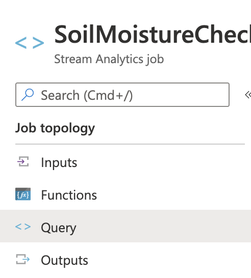
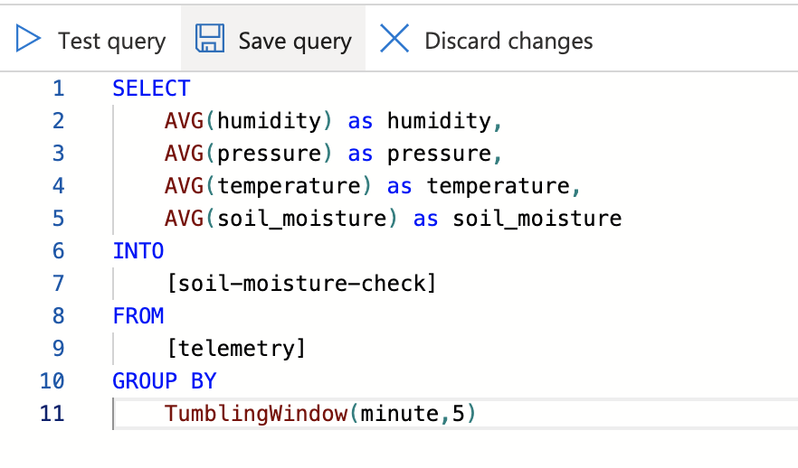
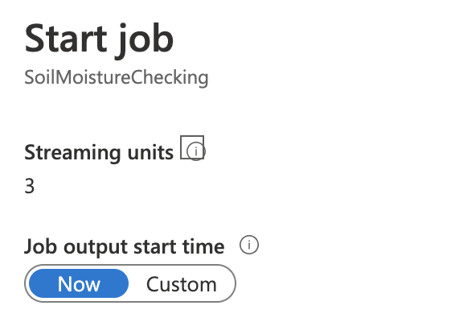
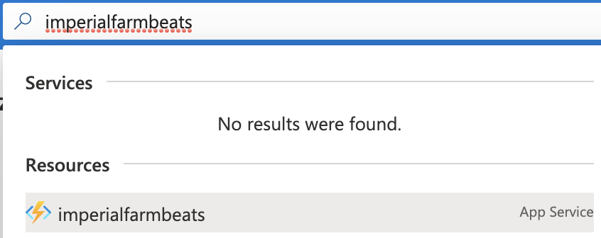
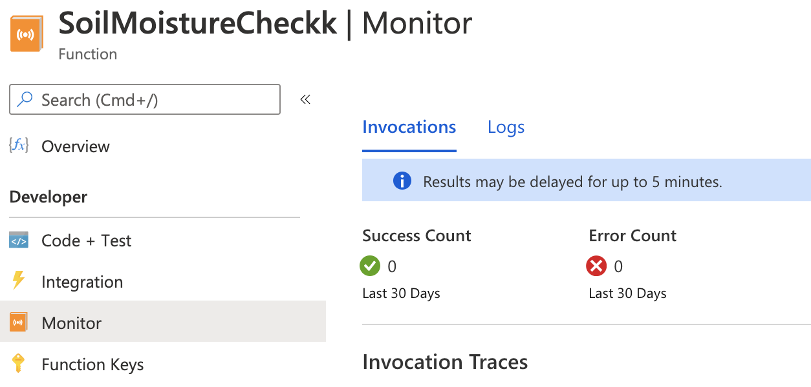

# Create a new Azure Stream Analytics Job

## Create the job

1. Go to [Azure Portal](https://portal.azure.com/?WT.mc_id=agrohack-github-jabenn) and create a new Azure Stream Analytics Job. Name the job `SoilMoistureChecking`. Select the resource group we used in the previous tutorial.

   

## Set an input

1. From the Stream Analytics Job, select *Job topology -> Inputs* from the left-hand menu

   

1. Fill in the output details

   1. Set the alias to be `sensor_reading`

   1. Select *Select azure function from your subscriptions*

   1. Select your subscription

   1. Select the Event Hub created in the previous lab

   1. Select the `SoilMoistureCheck` function

   1. Leave the rest of the values as the defaults

   1. Select **Save**

## Set an output

1. From the Stream Analytics Job, select *Job topology -> Outputs* from the left-hand menu. 

   

   Then Select **+ Add**, click on **Azure function**.
   
   

1. Fill in the output details

   1. Set the alias to be `soil-moisture-check`

   1. Select *Select azure function from your subscriptions*

   1. Select your subscription

   1. Select the function app you just deployed to

   1. Select the `SoilMoistureCheck` function

   1. Leave the rest of the values as the defaults

   1. Select **Save**

    

## Create the query

1. From the Stream Analytics Job, select *Job topology -> Query* from the left-hand menu

   

1. Change the query to be the following

   ```sql
   SELECT
       AVG(humidity) as humidity,
       AVG(pressure) as pressure,
       AVG(temperature) as temperature,
       AVG(soil_moisture) as soil_moisture
   INTO
       [soil-moisture-check]
   FROM
       [telemetry]
   GROUP BY
       TumblingWindow(minute,5)
   ```

This will select data as it comes into the `telemetry` event hub, grouping data using a 5 minute [tumbling window](https://docs.microsoft.com/stream-analytics-query/tumbling-window-azure-stream-analytics?WT.mc_id=agrohack-github-jabenn). This groups data into 5 minute blocks and calls the query for each block. The query will get the average value of 4 telemetry values.

1. Select **Test Query** to test the query and see a sample output using real data from the event hub

   

1. Click **Save Query**

   

## Start the job

1. From the Stream Analytics Job, select *Overview* from the left-hand menu, then select **Start** button on the right-hand side

   

1. For the *Job output start time* select **Now**

1. The `start job` window will pop up, click on **Start** at the bottom of this window

   

## Validate the query

The easiest way to ensure the query is running correctly is by verifying that the Azure Function gets called.

1. Go back to the [Azure Portal](https://portal.azure.com/?WT.mc_id=agrohack-github-jabenn)

1. Log in with your Microsoft account if required

1. In the search bar, search for you Function Apps name. Select the Function app. It will be marked as an *App Service* and have a lightning bolt icon.

   
   
1. Select the Azure Function we created in the last tutorial, expand the nodes and select **Monitor**. When the Azure Function is called an entry will appear in the table with a green tick.

   

   It will take a few minutes for rows to appear as each window is 5 minutes, so nothing will appear until the 5 minute window is complete. Refresh the window using the **Refresh** button after a few minutes to see rows appear.

<hr>

In this step you created an Azure Function triggered by Azure Stream Analytics to check soil moisture.

-----------------

Next Step: [Execute IoT Command](Execute_IoT_Command.md)
